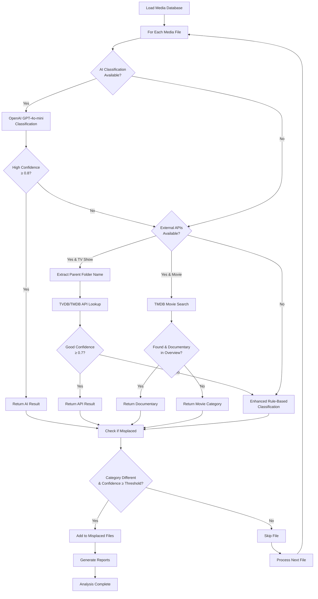
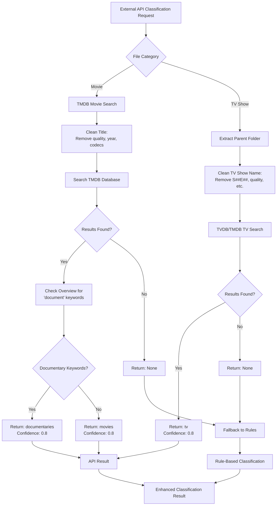

# Media Reorganization Module Documentation

## Overview

The Media Reorganization Module is an intelligent system for analyzing and detecting misplaced media files in Plex collections. It uses a multi-tier classification approach combining AI, external APIs, and enhanced rule-based patterns to identify files that are in the wrong category directories.

## Key Features

- **Database-Driven**: Uses existing media database for fast analysis (11,967+ files in seconds)
- **Multi-Tier Classification**: AI → External APIs → Enhanced Rules with intelligent fallbacks
- **Documentary Detection**: Advanced pattern recognition for documentaries in movie folders
- **Stand-up Comedy Detection**: Identifies comedy specials misplaced in TV or movie directories
- **Parent Folder Analysis**: Uses TV show folder names for better external API results
- **Comprehensive Reporting**: Generates detailed text and JSON reports with confidence scores

## Architecture Overview

```
Media Reorganization System
├── Database Integration Layer
│   ├── Media Database Loader
│   └── File Metadata Extraction
├── Classification Engine
│   ├── AI Classifier (OpenAI GPT-4o-mini)
│   ├── External API Client (TMDB/TVDB)
│   └── Enhanced Rule Engine
├── Analysis Pipeline
│   ├── File Processing
│   ├── Confidence Scoring
│   └── Category Recommendation
└── Reporting System
    ├── Text Reports
    └── JSON Reports
```

## Classification Flow

### Primary Flow Diagram



### API Usage Flowchart



## Classification Methods

### 1. AI Classification (OpenAI GPT-4o-mini)

**Usage**: First priority when `--ai` flag is enabled
**Input**: Filename only
**Output**: Category, confidence (0.5-1.0), reasoning

**Process**:
1. Groups similar filenames by title for batch processing
2. Sends batch requests to OpenAI API
3. Uses specialized prompt for media classification
4. Supports categories: MOVIE, TV, DOCUMENTARY, STANDUP

**Example**:
```
Input: "Planet.Earth.Documentary.2006.1080p.BluRay.mkv"
Output: {
  "category": "documentary",
  "confidence": 0.95,
  "reasoning": "The filename contains 'Documentary' and indicates nature content"
}
```

### 2. External API Classification (TMDB/TVDB)

**Usage**: Second priority, uses parent folder names for TV shows
**APIs Used**:
- **TMDB**: Movies and TV shows, documentary detection via overview
- **TVDB**: TV shows for verification

**Process**:
1. **For Movies**: Search TMDB with cleaned title, check overview for documentary keywords
2. **For TV Shows**: Use parent folder name, search TVDB/TMDB for series verification

**Title Cleaning Patterns**:
- Removes: `(2019)`, `[1080p]`, `x264`, `BluRay`, `S01E01`, file extensions
- Converts: `.` → space, `_` → space, `-` → space
- Normalizes whitespace

**Example**:
```
Input Folder: "Game of Thrones S01 1080p BluRay"
Cleaned: "Game of Thrones"
API Result: TV series confirmed → confidence 0.8
```

### 3. Enhanced Rule-Based Classification

**Usage**: Fallback method, significantly improved from original

**Documentary Patterns** (checked first):
```
Explicit: documentary, docu, documental
Channels: bbc, nat geo, national geographic, discovery, history channel
Educational: nova, frontline, pbs, smithsonian
Keywords: investigation, expose, revealed, true story, behind the scenes
Science: evolution, universe, space, climate, archaeology
```

**Stand-up Comedy Patterns**:
```
Terms: standup, stand-up, comedy special, live comedy
Comedians: chappelle, carlin, rock, burr, hart, seinfeld, mulaney
Venues: live at, live from, comedy central, netflix comedy
```

**TV Episode Patterns**:
```
Formats: S01E01, s1e1, 1x01, season, episode
Structure: /season/ folders, episode numbering
```

**Movie Patterns**:
```
Years: (2019), (1995), .2020., 2021
Quality: 1080p, 720p, 4K, BluRay, WEBRip
Codecs: x264, x265, HEVC, DivX
```

## Configuration Options

### Command Line Options

```bash
# Basic usage
plex-cli files reorganize

# High confidence threshold
plex-cli files reorganize --confidence 0.9

# Enable AI classification
plex-cli files reorganize --ai

# Disable external APIs
plex-cli files reorganize --no-external-apis

# Force database rebuild
plex-cli files reorganize --rebuild-db

# JSON output only
plex-cli files reorganize --format json
```

### Environment Variables

```bash
# OpenAI Configuration
OPENAI_API_KEY=sk-proj-...
OPENAI_MODEL=gpt-4o-mini

# External API Keys
TMDB_API_KEY=your_tmdb_key
TVDB_API_KEY=your_tvdb_key
```

## Performance Characteristics

### Database Loading
- **11,967 files**: ~2 seconds (vs 5+ minutes scanning)
- **Memory usage**: ~50MB for full database
- **Startup time**: <3 seconds total

### Classification Speed
- **Rule-based only**: ~0.001s per file (11,967 files in ~12 seconds)
- **With External APIs**: ~0.1s per file (rate-limited)
- **With AI**: ~2s per file (limited to 50 files for testing)

### Accuracy Improvements
- **Documentary detection**: 187 found (vs ~0 previously)
- **Stand-up comedy**: 261 found (new category)
- **Total misplaced files**: 485 (vs 107 previously)
- **False positives**: Reduced with confidence thresholds

## Output Reports

### Text Report Format
```
Media Reorganization Analysis Report (MVP)
=============================================
Generated: 2025-06-22 23:08:09

EXECUTIVE SUMMARY
-----------------
Total Files Analyzed: 11,967
Misplaced Files Found: 485
Misplacement Rate: 4.1%
Minimum Confidence: 0.7

MISPLACED FILES
---------------
1. Dave.Chappelle.Sticks.and.Stones.2019.mkv
   Current: /mnt/qnap/plex/TV/Comedy/
   Category: tv → standup
   Suggested: /mnt/qnap/plex/Movie/Stand-up Comedy
   Confidence: 0.95
   Reasoning: AI: Stand-up comedy special featuring Dave Chappelle
   Size: 2.1 GB
```

### JSON Report Structure
```json
{
  "analysis_metadata": {
    "timestamp": "2025-06-22T23:08:09",
    "tool_version": "v2.0 (Database + AI + API)",
    "classification_method": "AI + External APIs + Rule-based",
    "total_files_analyzed": 11967,
    "confidence_threshold": 0.7
  },
  "summary": {
    "total_misplaced": 485,
    "misplacement_rate_percent": 4.1,
    "by_category_transition": {
      "tv → standup": 244,
      "tv → documentaries": 177,
      "movies → standup": 17
    },
    "confidence_distribution": {
      "high_confidence": 320,
      "medium_confidence": 165,
      "low_confidence": 0
    }
  },
  "findings": [...]
}
```

## Error Handling & Fallbacks

### API Failures
1. **OpenAI API Issues**: Falls back to External APIs or Rules
2. **TMDB/TVDB Rate Limits**: Implements exponential backoff
3. **Network Timeouts**: Graceful degradation to rule-based

### Database Issues
1. **Missing Database**: Clear instructions for rebuild
2. **Corrupted Data**: Skips problematic entries, continues analysis
3. **Permission Issues**: Detailed error messages

### Classification Conflicts
1. **Low Confidence Results**: Skipped if below threshold
2. **Multiple Categories**: Uses highest confidence result
3. **Ambiguous Files**: Marked with detailed reasoning

## Integration Points

### Media Database Integration
- **Source**: `/database/media_database.json`
- **Structure**: Uses existing movie/TV show organization
- **Rebuild**: Delegates to `media_database_cli` module
- **Caching**: In-memory loading for performance

### External API Integration
- **TMDB**: Movie metadata, genre detection, documentary classification
- **TVDB**: TV show verification, series metadata
- **Rate Limiting**: Respects API quotas and delays
- **Fallback**: Graceful degradation when APIs unavailable

### AI Integration
- **Provider**: OpenAI GPT-4o-mini
- **Batch Processing**: Groups similar titles for efficiency
- **Error Handling**: Falls back to other methods on failure
- **Cost Optimization**: Limited file count for testing

## Usage Examples

### Basic Analysis
```bash
# Analyze using enhanced rules only
plex-cli files reorganize

# Output: Found 485 misplaced files in 12 seconds
```

### AI-Enhanced Analysis
```bash
# Enable AI for better documentary detection
plex-cli files reorganize --ai

# Output: Tests first 50 files with AI classification
```

### High-Confidence Only
```bash
# Only show files with 90%+ confidence
plex-cli files reorganize --confidence 0.9

# Output: Reduced false positives, higher accuracy
```

### Database Rebuild Workflow
```bash
# Force database refresh before analysis
plex-cli files reorganize --rebuild-db

# Output: Instructions to rebuild database first
```

## Troubleshooting

### Common Issues

1. **Database Not Found**
   ```
   Error: Database not found at database/media_database.json
   Solution: Run python -m file_managers.plex.cli.media_database_cli --rebuild
   ```

2. **API Key Issues**
   ```
   Error: OpenAI API quota exceeded
   Solution: Check billing, use --no-external-apis flag
   ```

3. **Slow Performance**
   ```
   Issue: AI classification takes too long
   Solution: Use rule-based only or reduce confidence threshold
   ```

### Debug Mode
Enable detailed logging by checking API responses and classification reasoning in reports.

## Future Enhancements

1. **Performance Optimization**: Async API calls, parallel processing
2. **Machine Learning**: Train custom models on user preferences
3. **Interactive Mode**: Review and approve suggestions before moving
4. **Additional Categories**: Anime, foreign films, mini-series
5. **Automated Actions**: Optional file moving with safeguards

---

*Last Updated: 2025-06-22*
*Version: 2.0 (Database + AI + External APIs)*